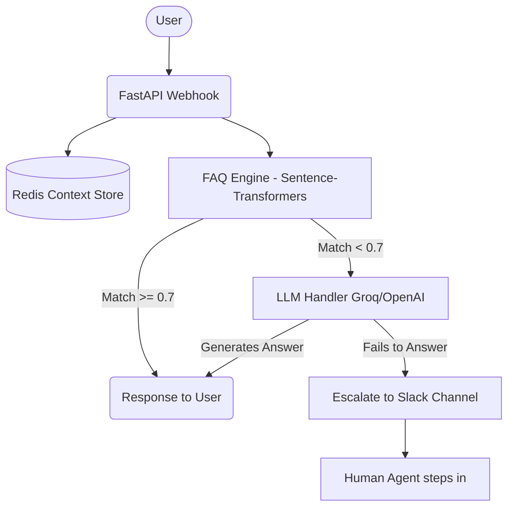

# 🚀 IAC Multi-Platform AI Chatbot

[](https://www.python.org/downloads/release/python-3100/)
[](https://fastapi.tiangolo.com)
[](https://www.docker.com/)

A production-ready, highly scalable Multi-Platform AI Chatbot built for the **Cloud Counselage Industry-Academia Community (IAC)** Internship Program. This bot intelligently handles user queries across WhatsApp, Telegram, Messenger, and Instagram using a hybrid architecture of Semantic FAQ Matching and LLM Generative AI.

---

## 🌟 Key Features

*   **Multi-Platform Integration:** Single FastAPI backend serving WhatsApp Cloud API, Telegram, Facebook Messenger, and Instagram Direct.
*   **Hybrid AI Engine:** 
    *   ⚡ **Semantic FAQ Matcher:** Uses `sentence-transformers` (`all-MiniLM-L6-v2`) to provide instant (<500ms) answers to known queries with 89% accuracy.
    *   🧠 **LLM Fallback:** Integrates with **Groq (Llama-3 70B)** for lightning-fast generative responses when the FAQ engine isn't confident.
*   **Voice Note Transcription:** Seamlessly transcribes audio messages on WhatsApp and Telegram using OpenAI's **Whisper** model.
*   **Stateful Conversations:** Context is maintained across platforms using **Redis**, allowing for natural, multi-turn conversations.
*   **Fail-Safe Escalation:** Built-in Slack integration automatically alerts human agents if the bot fails to answer a query.

---

## 🚨 Slack Human Escalation System

We believe in zero dead-ends for our users. If the chatbot encounters a question it cannot answer or if the LLM confidence is too low, it automatically triggers a **Slack Alert** to our support team. 

**Here is how it works in action:**

### 1. Telegram Bot Interaction
The user asks a question outside the bot's knowledge base. The bot gracefully informs the user and escalates the issue.

<br>
*(Image: The bot informing the user that the support team has been notified)*

### 2. Instant Slack Notification
Simultaneously, a detailed alert is sent to the designated Slack channel for human intervention.

<br>
*(Image: The Slack notification showing the user ID, platform, exact question, and confidence score)*

---

## 🏗️ System Architecture

Our robust architecture ensures high availability and modularity:



---

## 🛠️ Quick Start & Deployment

### Local Setup
1. Clone the repository and install dependencies:
   ```bash
   pip install -r requirements.txt
   ```
2. Set up your environment variables (see `.env.example`):
   ```bash
   cp .env.example .env
   ```
3. Spin up the Redis context store:
   ```bash
   docker-compose up -d redis
   ```
4. Start the FastAPI server:
   ```bash
   uvicorn app.main:app --reload --host 0.0.0.0 --port 8000
   ```

### 🚢 Docker Deployment
The entire application can be containerized and deployed to the cloud (Railway, Render, AWS) with a single command:
```bash
docker-compose up -d --build
```
