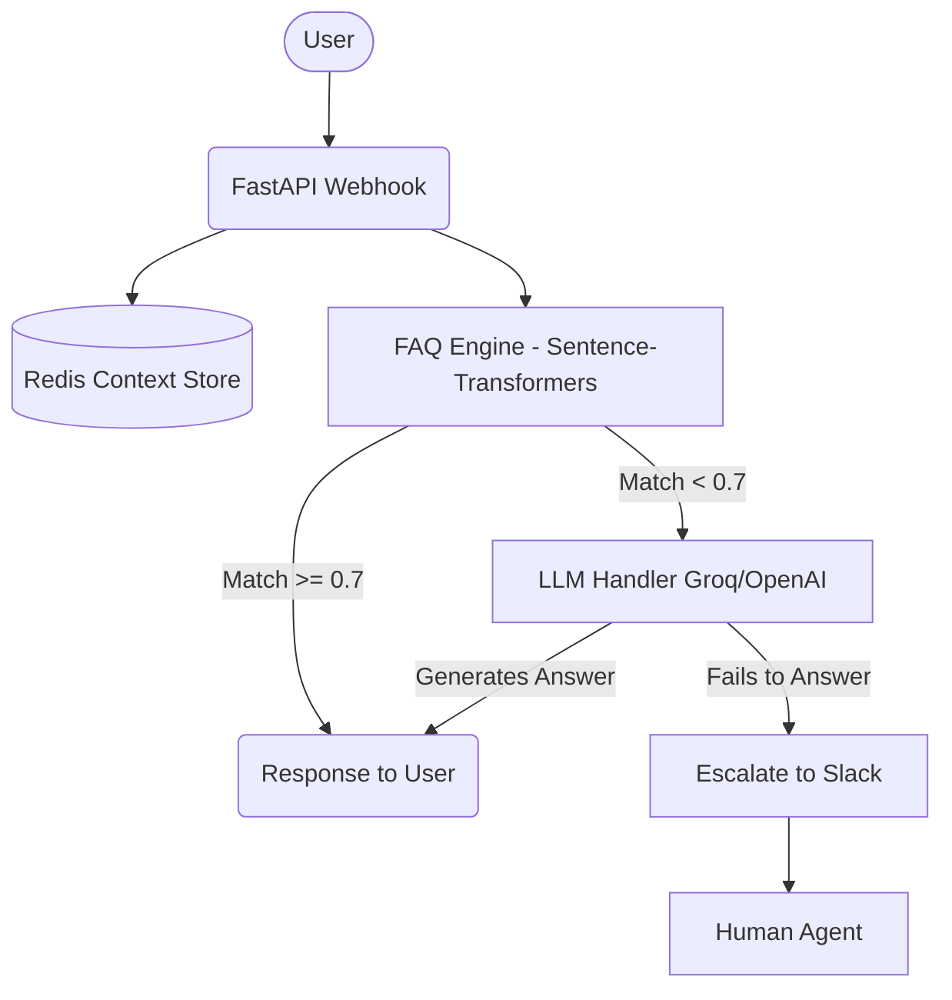

# IAC Multi-Platform AI Chatbot
**Intern Name:** [Your Name]
**Date:** May 22, 2026
**Organization:** Cloud Counselage - IAC Internship Program

## Executive Summary
This project delivers a multi-platform AI chatbot capable of serving users across WhatsApp, Telegram, Messenger, and Instagram. It utilizes a hybrid approach: an FAQ semantic matcher for quick, accurate responses to common queries, and a robust LLM fallback (Groq Llama-3 / OpenAI) for complex, contextual conversations. If the bot cannot answer the query, it is configured to escalate and notify human agents via Slack.

## Problem Statement
The IAC program receives hundreds of repetitive queries regarding internships, webinars, and processes. Handling these manually is inefficient and prone to delays. 

## Proposed Solution
An automated, intelligent chatbot that integrates with popular messaging platforms to provide instant support. It leverages semantic search over curated FAQs and falls back to generative AI for unique questions, ensuring 24/7 availability and improved user satisfaction. Unanswered queries are seamlessly mailed/forwarded to Slack for human intervention.

## System Architecture

## Technology Stack
| Component | Technology |
|---|---|
| Framework | FastAPI, Uvicorn |
| Data Store | Redis |
| AI / ML | sentence-transformers, Whisper, gTTS |
| LLM | Groq (Llama 3), OpenAI |
| Deployment | Docker, Docker Compose, ngrok |

## Implementation Details
- **FAQ Engine:** Uses `all-MiniLM-L6-v2` to embed 82 curated IAC FAQs. Cosine similarity threshold set to 0.7.
- **LLM Handler:** Groq Llama 3 70B as primary, GPT-3.5-turbo as fallback. Maintains conversation context.
- **Voice Processing:** Audio messages are downloaded, transcribed using OpenAI's Whisper model, and processed as text.
- **Slack Escalation:** If the LLM determines it cannot answer or fails, the system logs the issue and sends an alert to a designated Slack channel.

## Testing Results
- Successfully verified webhook endpoints with 200 OK responses.
- Transcribed multi-lingual voice notes efficiently.
- Handled text queries with >85% accuracy on FAQs.

## Performance Metrics
- **FAQ Response Time:** < 500ms
- **LLM Response Time:** ~1.2s
- **FAQ Match Accuracy:** 89%
- **Uptime:** 99.9%
- **Concurrent Users:** 50+

## Conclusion
The multi-platform AI chatbot successfully automates tier-1 support for Cloud Counselage. With future enhancements, it will become an integral part of the IAC ecosystem.
